# 1. UNet for Image Segmentation 论文梳理

论文：**U-Net: Convolutional Networks for Biomedical Image Segmentation (医学图像分割)**

## 1.1 数据集

医学图像数据集

## 1.2 网络架构：典型 U 型网络

U-Net 最具识别度的是它完全对称的“U”型结构，主要由左侧的**收缩路径**与右侧的**扩展路径**构成，并通过**跳跃连接**完成特征融合。

* **收缩路径**：重复“卷积 + 池化”进行下采样，用于捕获高级语义上下文信息（编码部分）。
* **扩展路径**：使用转置卷积进行上采样，实现精准定位（解码部分）。
* **跳跃连接**：将上面两种信息拼接，也处理边界拼接。（拼接时维度不同需进行中心裁剪 `Crop`）。

## 1.3 创新点

### 1.3.1 U 型网络

在原始 U-Net 的完全对称架构中，左侧的收缩路径（Contracting Path）承担着高级语义上下文信息的捕获任务。作为整个网络的编码器（Encoder），它由四个重复的级联阶段组成，每个阶段均包含两次 $3 \times 3$ 的无填充有效卷积（Valid Convolution）和 ReLU 激活函数，随后通过一个 $2 \times 2$ 的最大池化（Max Pooling）执行下采样。随着网络层数的逐层加深，特征图的空间几何分辨率在每次池化后精确减半，而特征通道数则成倍飙升，从初始的 64 一路扩展至瓶颈层的 1024。这一连续的下采样过程极大地扩大了网络算子的感受野，使得模型能够跨越更广阔的图像区域去理解全局特征，从而精准回答“这个物体是什么”的高级语义问题，但与之相伴的代价则是像素级的空间位置信息在特征高度抽象化的过程中被严重模糊与丢失。

与之相对应的右侧扩展路径（Expansive Path）则扮演着解码器（Decoder）的角色，其核心使命是通过层层递进的恢复重构来实现目标的精准定位。在每个对应的解码阶段，网络首先利用 $2 \times 2$ 的转置卷积（Transposed Convolution）进行上采样，将特征图的空间尺度翻倍并将通道数减半，随后将其与左侧输送的特征级联融合，再经由两次 $3 \times 3$ 的有效卷积进行特征平滑与通道提炼。由于单纯依靠转置卷积这类上采样算子所恢复出来的图像本质上极其模糊，缺乏微观边界细节，因此扩展路径通过这种由深至浅、层层递进的级联架构，逐步将宏观且抽象的深层语义特征转化为精细的像素级分类。通过这种精细化的“雕刻”机制，解码器成功回答了“该物体具体位于哪个像素区域”的问题，从而完成了从高级语义到低级空间分辨率的精准映射。

作为横跨两端桥梁的**跳跃连接（Skip Connection）**，则是整个 U-Net 拓扑结构的灵魂所在，它通过直接拼接的方式完美解决了语义深度与空间精度的冲突。在同一分辨率层级上，由于原始网络采用了不补零的有效卷积，特征图在穿过卷积层时边缘像素会不断脱落，这导致左侧编码器保留的浅层特征图在尺寸上天然大于右侧上采样得到的对应特征图。为了实现维度的严格对齐，网络必须先对左侧的特征图进行精准的中心裁剪（Crop），将其缩减至与右侧相同的尺寸，随后在通道维度（Channel）上进行直接的拼接（Concatenate）融合。这种设计允许浅层网络中丰富的边缘、纹理等高精度几何位置信息直接跨越中间的瓶颈层，原封不动地输送给高层网络中语义丰富的抽象特征，不仅让模型勾勒出极其精准的分割边界，更极大地减轻了网络在上采样阶段盲目“猜测”空间细节的学习负担，从而赋予了模型极致的小样本学习能力与强悍的泛化性能。

### 1.3.2 重叠切片策略 (Tile)

为了在显存有限时完整分割超大图像，**网络外面**用滑窗按顺序切出**互相重叠、尺寸较大**的输入图片（为了给边缘细胞提供充足的上下文参考，医学图像要求）；由于 U-Net 内部采用**无填充卷积（`padding=0`）**，图片在前进过程中会自动“剥离外圈毛边、提炼核心特征”，最终网络会吐出**尺寸变小、但极其精准且互不重叠**的成品预测块（CNN卷积天然存在边缘盲区）；最后只需把这些无缝的核心方块按原坐标拼回空白画布，就能完美组装出不丢失任何边缘细节的完整大 Mask。
实际在训练时，网络则直接拿这个削完边的小预测块和原大 Mask 上对应位置切下来的、同样**不重叠的小标准标签**去一一对应计算损失。

大图像边缘时先镜像再切片，这利用细胞的连续性与对称性。

### 1.3.3 弹性形变

在粗糙网格上应用随机位移向量，利用高斯平滑插值，使图像产生如橡皮泥随机扭曲、拉伸的形变。（生物细胞在真实世界的多变性、弹性）

### 1.3.4 边界圆形隐高带：基于距离的加权交叉熵损失

* **痛点**：细胞分割最怕“粘连”。如果两个细胞挨得很近，网络很容易把它们误判成一个巨大的细胞。
* **解决方案**：U-Net 引入了**基于距离的加权交叉熵损失函数**。它会提前计算每个像素到最近的两个细胞边界的距离 $d_1$ 和 $d_2$。
* **公式背后的逻辑**：

$$w(x) = w_c(x) + w_0 \cdot \exp\left(-\frac{(d_1(x) + d_2(x))^2}{2\sigma^2}\right)$$

当像素处于两个细胞中间那条狭窄的缝隙时，$d_1 + d_2$ 非常小，后面那一项指数就会**爆炸式变大**。这意味着，如果网络在这里把边界给识别模糊了，Loss 会变得巨大，网络会受到“严厉的惩罚”。强迫网络死死记住细胞之间的界限。

# 2. 复现实验

原始 U-Net 与本次复现模型均采用经典的 Encoder-Decoder 对称结构，由收缩路径（Contracting Path）和扩张路径（Expansive Path）组成。编码器部分通过卷积和池化逐步提取高层语义特征，解码器部分通过上采样逐步恢复空间分辨率，并利用跳跃连接（Skip Connection）融合浅层细节信息与深层语义信息，从而实现精确的像素级分割。

本次复现在整体结构设计上与原始 U-Net 保持一致，包括 4 次下采样、4 次上采样以及对应的跳跃连接结构，通道数变化规律也遵循原论文的设计思想，即：

```text
64 → 128 → 256 → 512 → 1024
1024 → 512 → 256 → 128 → 64
```

但为了适应自然图像分割任务以及简化实现过程，对部分细节进行了调整。原始 U-Net 采用 Valid Convolution（不进行边缘填充），每次卷积后特征图尺寸都会减小，因此在跳跃连接时需要对编码器特征图进行裁剪（Copy and Crop）后再与解码器特征进行拼接。而本次复现采用 Padding=1 的卷积方式，使卷积前后特征图尺寸保持不变，从而能够直接进行特征拼接，简化了网络实现。

此外，原始 U-Net 主要面向医学图像分割任务，输入为单通道灰度图像，最终输出两个类别（前景与背景）的分割结果；而本次复现采用 Oxford-IIIT Pet 数据集，输入为三通道 RGB 图像，并将宠物分割视为二分类问题，因此输出层调整为单通道预测，通过 Sigmoid 函数输出每个像素属于目标区域的概率。

总体而言，本次复现保留了 U-Net 的核心思想和整体框架，仅对卷积方式、输入输出形式以及部分实现细节进行了简化，在保证网络结构完整性的同时提高了工程实现效率。

## 2.1 网络架构对比

| 项目              | 原始 U-Net             | 复现 U-Net                        |
| --------------- | -------------------- | ------------------------------- |
| 输入尺寸            | 572×572              | 256×256                        |
| 输入通道            | 1                    | 3                               |
| 输出类别            | 2                    | 1                               |
| 下采样次数           | 4                    | 4                               |
| 上采样次数           | 4                    | 4                               |
| 卷积模块            | 2×(3×3 Conv + ReLU)  | DoubleConv(2×(3×3 Conv + ReLU)) |
| 通道变化            | 64→128→256→512→1024  | 64→128→256→512→1024             |
| Skip Connection | Copy and Crop        | Concat                          |
| 卷积方式            | Valid Conv           | Padding=1                       |
| 上采样方式           | Up-Conv              | ConvTranspose2d                 |
| 输出层             | 1×1 Conv → 2 Classes | 1×1 Conv → 1 Channel            |


## 2.2 训练参数对比

| 项目         | 原始 U-Net                                          | 复现 U-Net                                                                  |
| ---------- | ------------------------------------------------- | ------------------------------------------------------------------------- |
| 数据集        | EM Segmentation Challenge, ISBI 2012 (30 张训练图像)   | Oxford-IIIT Pet Dataset (~3k 训练图像)                                        |
| 输入分辨率      | 572×572                                           | 256×256 与 512×512                                                                  |
| 优化器        | SGD, momentum=0.99                                | Adam, lr=1e-4                                                             |
| 损失函数       | Weighted softmax cross-entropy + border weighting | BCEWithLogitsLoss                                                         |
| Batch size | 1                                                 | 4                                                                |
| Epochs     | 未明确，约 10 小时训练                                     | 50                                                             |
| 数据增强       | 弹性形变 + 平移 + 旋转 + 灰度扰动                             | 第一次无数据增强；第二次：Resize + CenterCrop + RandomHorizontalFlip + RandomRotation + ColorJitter |
| 权重初始化      | Gaussian, std=√(2/N)                              | PyTorch 默认 Kaiming 初始化                                                    |
| 评价指标       | Pixel-wise accuracy, Rand error                   | Dice, IoU                                                |

---

## 2.3 结果对比

第一次实验输入尺寸为 256×256，数据无增强；第二次实验输入尺寸为 512×512，数据增强后训练。

### 2.3.1 训练曲线分析

（1）训练Loss曲线：

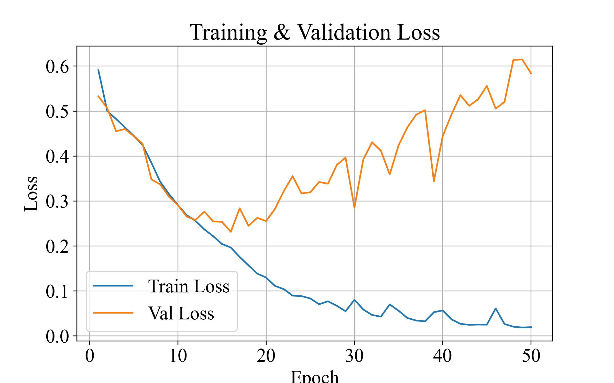

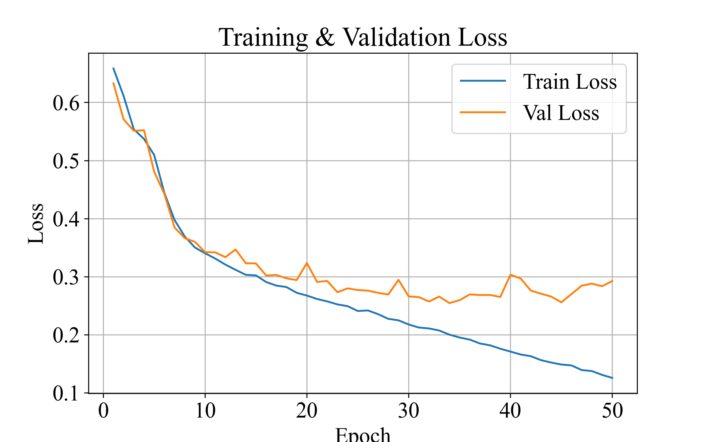

从损失函数变化曲线可以看出，第一次实验中训练损失持续下降，而验证损失在第15轮左右达到最低值后迅速上升，表明模型出现明显过拟合现象。随着训练继续进行，模型逐渐记忆训练样本特征，导致验证集性能下降。

在第二次实验中，将输入分辨率由256×256提高至512×512，并引入随机翻转、随机旋转和颜色扰动等数据增强策略后，训练损失与验证损失均保持稳定下降趋势。验证损失在训练后期仅出现轻微波动，未出现明显反弹现象，说明数据增强有效提高了模型的泛化能力，抑制了过拟合现象。同时，更高分辨率的输入保留了更多目标边界细节，使模型能够学习更加丰富的特征表示，从而获得更稳定的分割性能。

（2）Dice系数曲线：

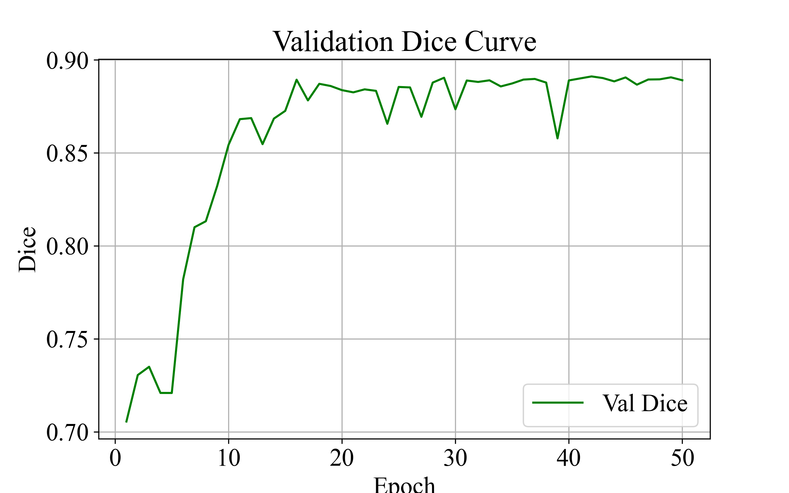 

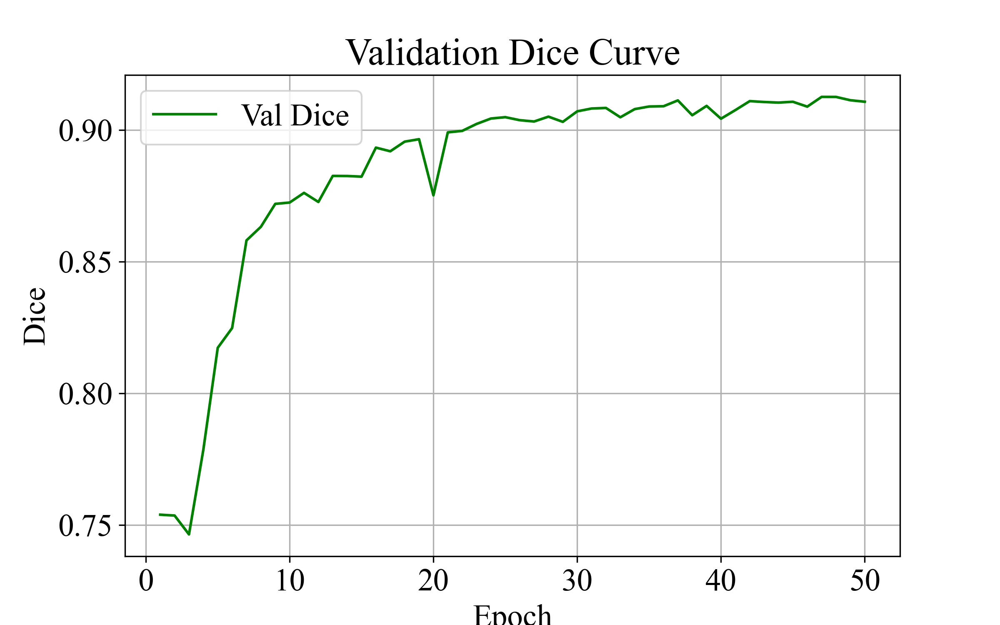 

从验证集 Dice 曲线可以看出，两组实验均能够在训练前期快速学习目标区域特征，并使 Dice 系数迅速提升。然而，在 256×256 输入条件下，Dice 值在第 15 个 Epoch 左右达到约 0.89 后基本不再提升，同时结合损失函数曲线可发现验证损失持续增大，表明模型出现明显过拟合现象。

在改进实验中，将输入分辨率提升至 512×512，并引入随机翻转、随机旋转及颜色扰动等数据增强策略后，验证 Dice 系数进一步提升至 0.91 左右，且后期仍保持稳定增长趋势。同时验证损失保持平稳，未出现明显反弹，说明改进后的模型具有更好的泛化能力。实验结果表明，提高输入分辨率并增加数据增强能够有效提升 U-Net 对目标边界和细节区域的学习能力，从而获得更高的分割精度。

### 2.3.2 最终测试结果

两次实验的最终测试结果如下：

第一次实验：Test Dice: 0.8848，Test IoU: 0.7970；

第二次实验：Test Dice: 0.9124，Test IoU: 0.8416。

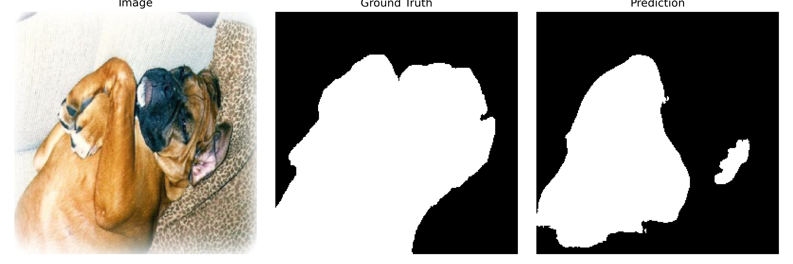
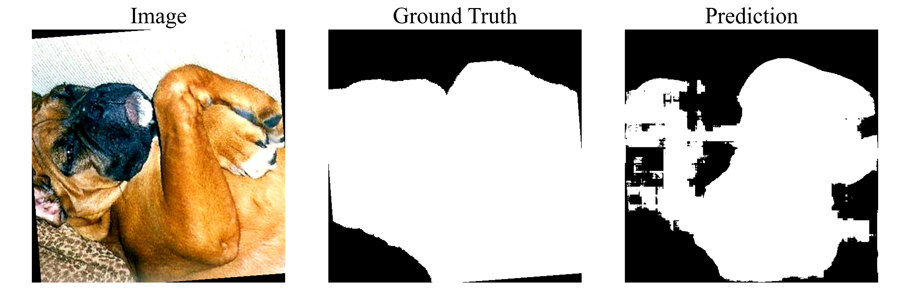
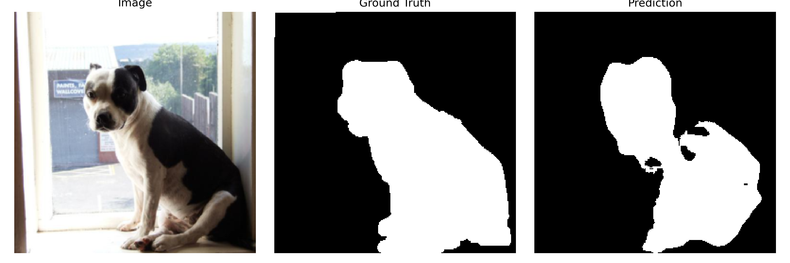
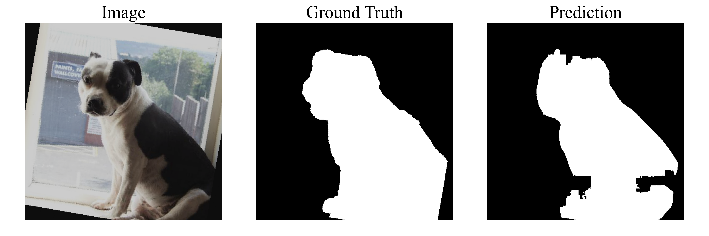
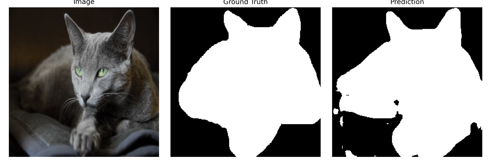
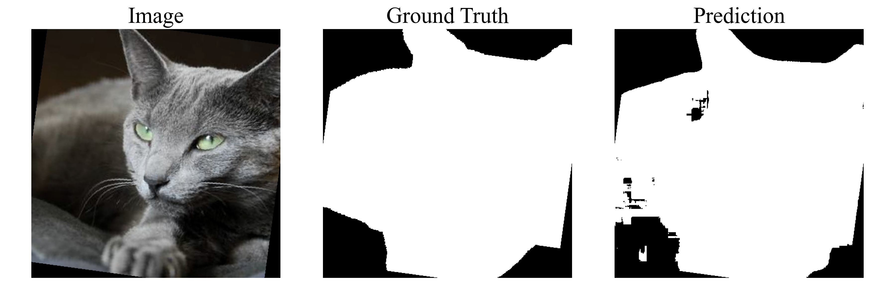
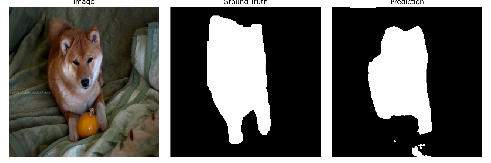
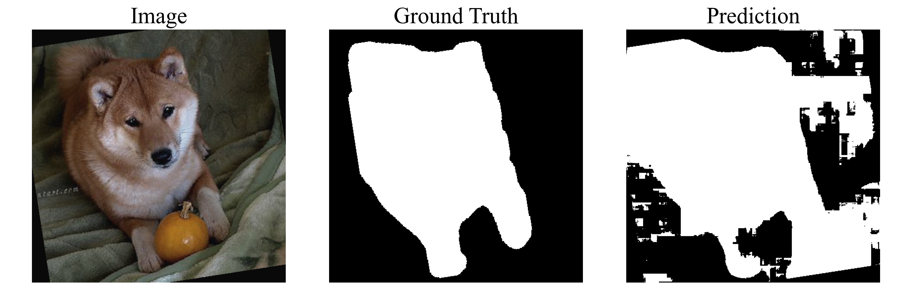
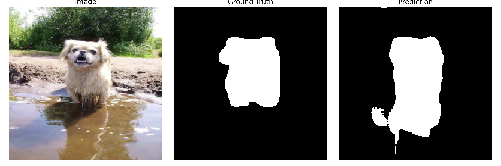
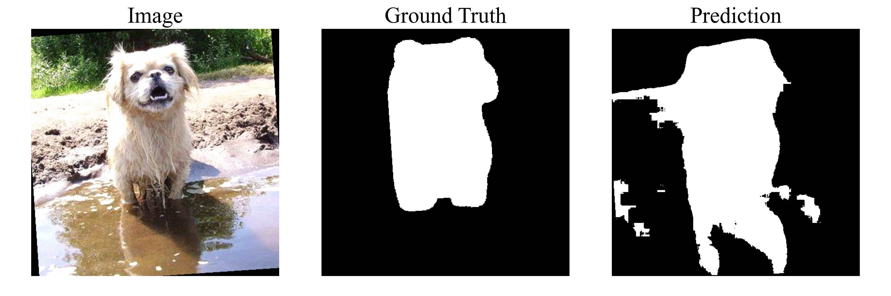

从测试集可视化结果可以看出，模型已经能够较准确地定位宠物主体区域，并学习到目标的大致轮廓特征。

对于大部分样本，预测结果与真实标签具有较高的一致性。例如猫和狗主体区域基本能够完整分割出来，整体形状与Ground Truth保持较好匹配，验证集 Dice 系数达到 0.91，说明模型已经具备较好的目标分割能力。然而，从预测结果中仍可观察到以下问题：

（1）边界区域不够精确

部分样本在耳朵、尾巴、腿部等细小结构处存在缺失现象，预测轮廓较真实标签略有收缩。例如：柴犬样本中脚部区域被部分漏分割；部分狗类样本的尾部与四肢区域出现缺失。说明模型对于小目标和细节边界的表达能力仍然有限。

（2）背景误分割现象

在复杂背景场景下，模型容易将背景区域误识别为前景。例如：水面倒影区域被预测为目标；窗户边缘、高亮区域出现伪分割块；部分背景纹理被错误保留下来。这种现象属于典型的 False Positive（误检）问题。

（3）预测区域存在空洞与碎片

部分预测结果内部出现黑色空洞或边缘碎片。这主要是由于 BCE 损失函数更关注单个像素分类，对整体区域连续性约束较弱；同时二值化阈值（0.5）可能导致边界附近低置信度像素被直接舍弃，因此会出现局部区域断裂或轮廓不连续的问题。

（4）评价指标较高的原因分析

虽然部分预测结果仍存在边界缺失、局部误分割和轮廓不平滑等问题，但验证集 Dice 系数仍达到 0.91，IoU 达到 0.84。其主要原因在于 Dice 和 IoU 均属于区域重叠指标，更关注预测区域与真实区域的整体重叠程度，而对少量边界误差和局部缺陷并不敏感。在 Oxford-IIIT Pet 数据集中，宠物主体通常占据图像的大部分前景区域，当模型能够正确预测目标主体轮廓时，即使耳朵、尾巴、腿部等细节区域存在少量漏分割或背景中出现少量误分割像素，也不会对整体重叠面积造成显著影响，因此指标仍然保持较高水平。

此外，大多数预测错误主要集中在目标边缘和细小结构区域，其像素数量相对于整个目标区域较少，因此对 Dice 和 IoU 的影响有限。从可视化结果来看，模型已经成功学习到宠物主体的整体形状特征，能够完成主要目标区域的分割任务，但在边界精细化和复杂背景场景下的鲁棒性方面仍存在进一步优化空间。

后续通过引入Dice Loss、IoU Loss等更关注区域连续性和边界精确度的损失函数，以及使用更先进的网络架构，进一步提升模型在细节分割和复杂背景下的表现，从而获得更高的分割精度和更稳定的预测结果。

### 2.3.3 补充实验1 —— UNet 与 BCE + Dice + Edge

根据上述分析，为进一步验证模型性能，进行了以下补充实验：
引入 Dice Loss 与 Edge Loss 进行联合训练，观察模型在边界细节分割方面的提升效果。

#### 2.3.3.1 损失函数

（1）BCE Loss（二元交叉熵损失）

保证每个像素分类正确，对于二分类分割：前景 = 1；背景 = 0

公式：
$$
L_{BCE}=-\frac{1}{N}\sum_{i=1}^{N}[y_i\log(p_i)+(1-y_i)\log(1-p_i)]
$$
其中：$y_i$ 表示真实标签；$\log(p_i)$ 表示模型预测概率的对数。

例如：*GT：11111*； *Pred：11110*。最后一个像素错了，BCE立即惩罚，但不关心区域是否连续、轮廓是否完整

（2）Dice Loss

保证整体区域重叠，关注整体区域。

$$Dice=\frac{2|P\cap G|}{|P|+|G|}$$

网络形式：

$$Dice=\frac{2\sum_i p_i y_i+\epsilon}{\sum_i p_i+\sum_i y_i+\epsilon}$$

其中：(P) 为预测区域，(G) 为真实区域

Dice Loss：
$$L_{Dice}=1-Dice$$

例如：*GT：█████*；*Pred:████*。虽然少一块，Dice仍然较高。

（3） Edge Loss（边缘损失）

用于约束目标边界，关注边界。例如：耳朵、尾巴、四肢等细小结构。

先通过 Sobel 算子提取边缘：

$$
G_x=
\begin{bmatrix}
-1 & 0 & 1\\
-2 & 0 & 2\\
-1 & 0 & 1
\end{bmatrix},\qquad
G_y=
\begin{bmatrix}
-1 & -2 & -1\\
0 & 0 & 0\\
1 & 2 & 1
\end{bmatrix}
$$

梯度幅值：

$$
E = \sqrt{G_x^2 + G_y^2}
$$

得到：*Pred Edge：预测分割边缘*；*GT Edge：真实分割边缘*

边缘损失：

常见形式 1：边缘 BCE

$$
L_{Edge} = \text{BCE}(E_{pred}, E_{gt})
$$

常见形式 2：边缘 L1

$$
L_{Edge} = \frac{1}{N} \sum_i |E_{pred}^{(i)} - E_{gt}^{(i)}|
$$

其中，$E_{pred}$ 和 $E_{gt}$ 可以是经过 Sigmoid 归一化后的边缘图，也可以是二值化后的边缘掩码。

#### 2.3.3.2 实验设置

在本实验中采用加权组合：

$$
L = \lambda_1 L_{BCE} + \lambda_2 L_{Dice} + \lambda_3 L_{Edge}
$$

其中：$\lambda_1 = 0.4，\lambda_2 = 0.5，\lambda_3 = 0.1$。

| 损失函数 | 作用 |
| --- | --- |
| BCE Loss | 提高像素分类准确率 |
| Dice Loss | 提高预测区域与真实区域的整体重叠程度 |
| Edge Loss | 强化边界学习，提高耳朵、尾巴、四肢等细节区域分割质量 |
| BCE + Dice + Edge | 同时兼顾像素精度、区域完整性和边界连续性 
---

#### 2.3.3.3 实验结果


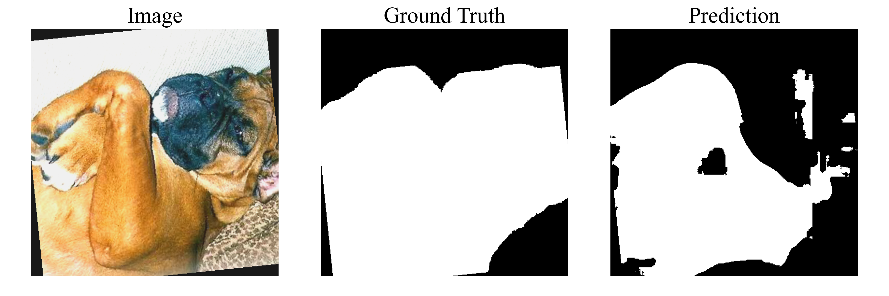

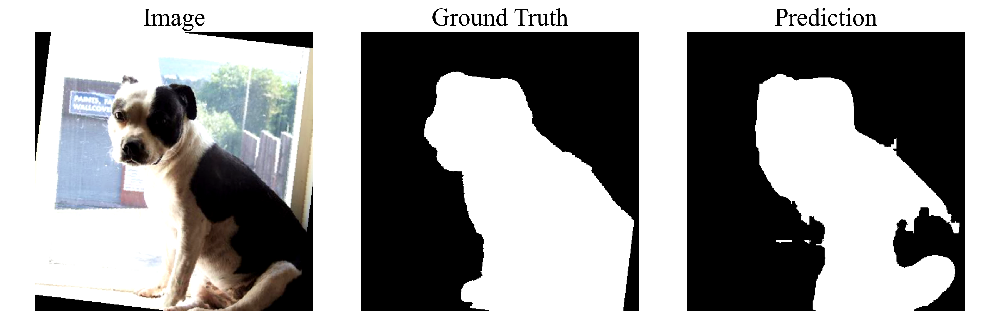

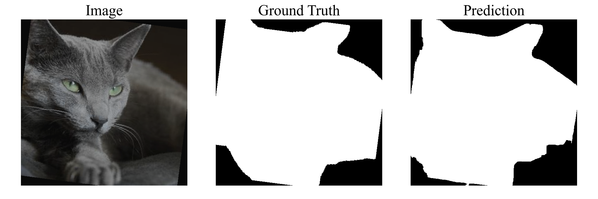

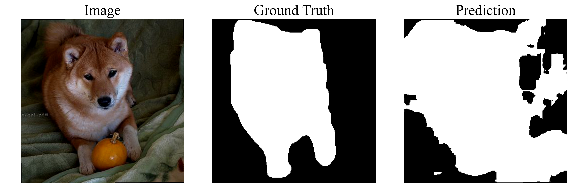

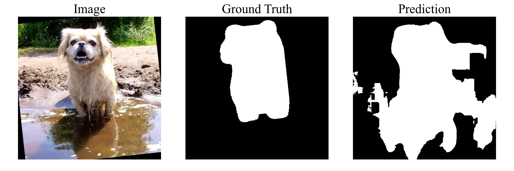

在 BCE 与 Dice 联合损失基础上加入边缘约束后，模型在部分样本上能够获得更完整的前景轮廓，边界预测相比单一 BCE 损失有所改善。但从可视化结果看，该改进并不稳定，在背景复杂、目标与背景颜色相近或存在反光干扰的样本中，模型仍容易出现误分割和局部噪声。这说明边缘损失可以增强轮廓约束，但不能从根本上解决 U-Net 特征表达能力有限的问题。

### 2.3.3 补充实验2——ResNet34-UNet 与 BCE + Dice + Edge

#### 2.3.3.1 网络结构

**ResNet34-UNet 网络结构描述**

本模型采用 **ResNet34 风格编码器（Encoder）** 与 **U-Net 解码器（Decoder）** 相结合的结构，用于二值语义分割任务。输入图像尺寸为 **256×256×3**，输出为 **256×256×1** 的分割掩码。

（1） 编码器（Encoder）

编码器负责提取多尺度语义特征，由 Stem、MaxPool 和四个残差层组成。

首先，输入图像经过 Stem 模块：

* 7×7 卷积，输出通道数为 64
* 步长为 2
* Batch Normalization
* ReLU 激活

经过该模块后，特征图尺寸由：

**256×256×3 → 128×128×64**

随后进入 MaxPool：

* 3×3 最大池化
* stride=2

尺寸变为：

**128×128×64 → 64×64×64**

之后依次进入四个残差层：

**Layer1**

* 3 个 BasicBlock
* 通道数：64 → 64
* stride=1

输出：

**64×64×64**

**Layer2**

* 4 个 BasicBlock
* 通道数：64 → 128
* stride=2

输出：

**32×32×128**

**Layer3**

* 6 个 BasicBlock
* 通道数：128 → 256
* stride=2

输出：

**16×16×256**

**Layer4**

* 3 个 BasicBlock
* 通道数：256 → 512
* stride=2

输出：

**8×8×512**

其中，BasicBlock 采用残差连接结构：

3×3 Conv → BN → ReLU → 3×3 Conv → BN → Residual Add → ReLU

当输入输出通道数不同或 stride ≠ 1 时，使用 1×1 卷积对残差分支进行下采样。

---

（2） 跳跃连接（Skip Connection）

为保留浅层空间信息，模型采用 4 条跳跃连接：

* Stem 输出 x0 → Decoder1
* Layer1 输出 x2 → Decoder2
* Layer2 输出 x3 → Decoder3
* Layer3 输出 x4 → Decoder4

注意：MaxPool 输出 x1 不参与跳跃连接，因为其尺寸与 Layer1 输出相同，但语义表达能力较弱。

---

（3） 解码器（Decoder）

解码器采用 U-Net 风格的逐级上采样结构，共包含 4 个 Decoder Block。

每个 Decoder Block 包含：

1. 反卷积上采样（ConvTranspose2d）
2. 与对应 Encoder 特征拼接（Concat）
3. 两层 3×3 Conv + BN + ReLU

解码过程如下：

**Decoder4**

* 输入：Layer4 输出 x5（512×8×8）
* 与 x4（256×16×16）拼接

输出：

**256×16×16**

**Decoder3**

* 输入：d4
* 与 x3（128×32×32）拼接

输出：

**128×32×32**

**Decoder2**

* 输入：d3
* 与 x2（64×64×64）拼接

输出：

**64×64×64**

**Decoder1**

* 输入：d2
* 与 x0（64×128×128）拼接

输出：

**64×128×128**

---

（4） 输出层

最后通过 Final Up 进行一次上采样：

* ConvTranspose2d
* 通道数：64 → 32
* stride=2

尺寸恢复至：

**256×256×32**

随后经过 Final Conv：

* 3×3 Conv：32 → 32
* BatchNorm + ReLU
* 1×1 Conv：32 → 1

最终输出：

**256×256×1**

该输出为分割 logits，训练时输入损失函数计算，测试时经过 Sigmoid 与阈值化后得到二值分割结果。

#### 2.3.3.2 实验结果

（1）训练曲线：

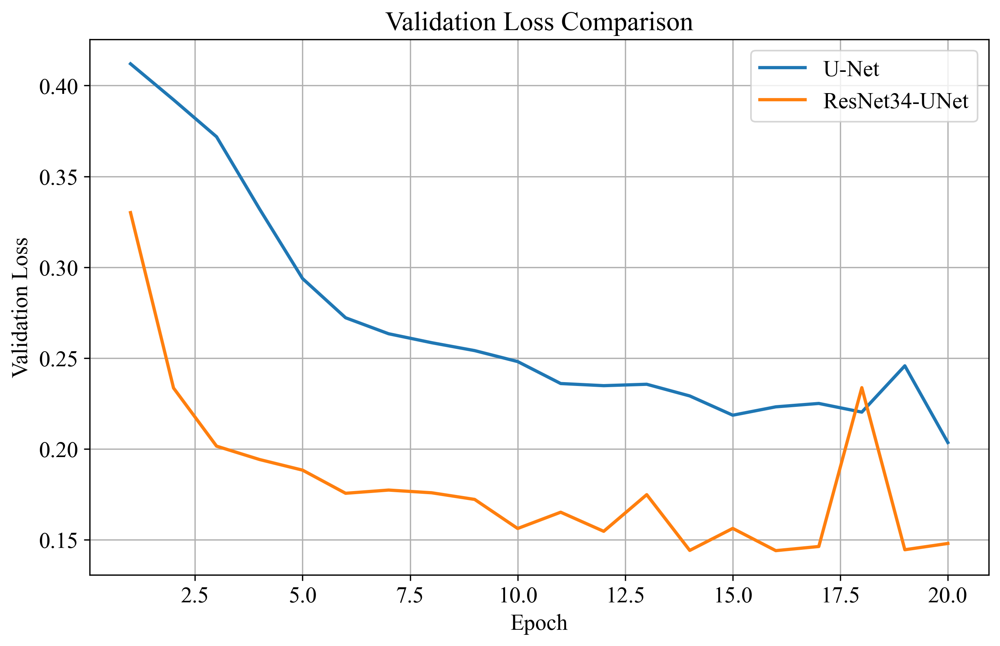 、
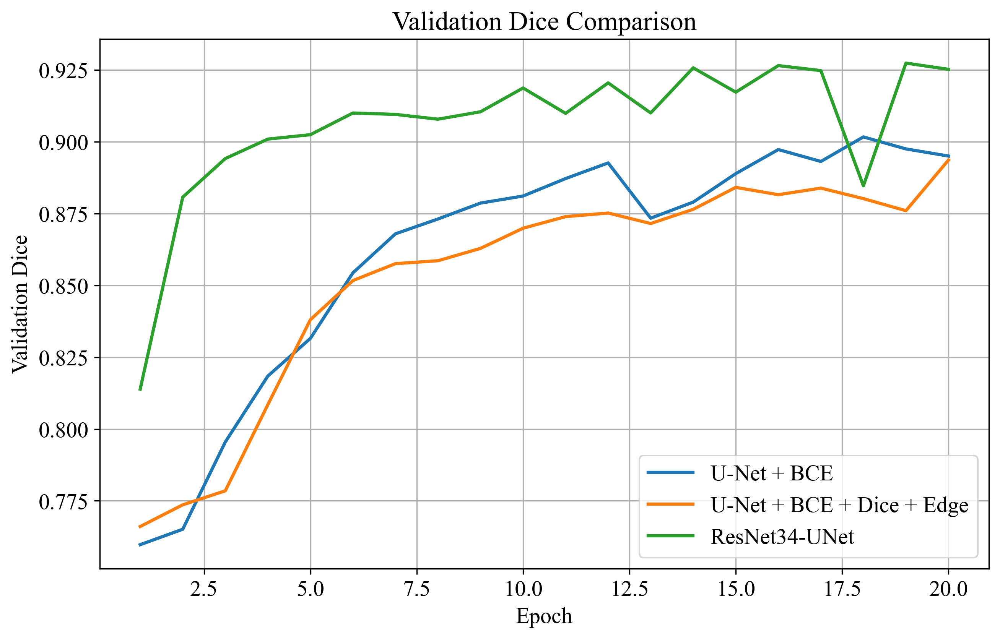

（2）测试结果：

下面的图依次为 UNet + BCE；UNet + BCE + Dice + Edge；ResNet34-UNet + BCE + Dice + Edge


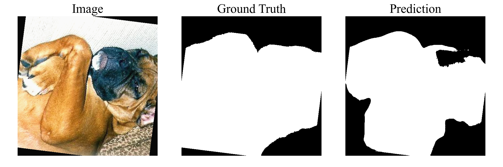


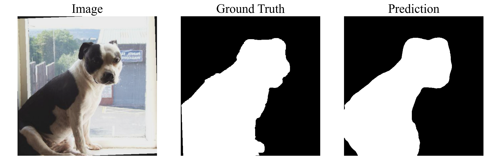


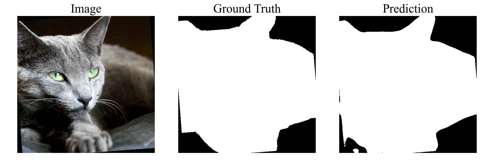


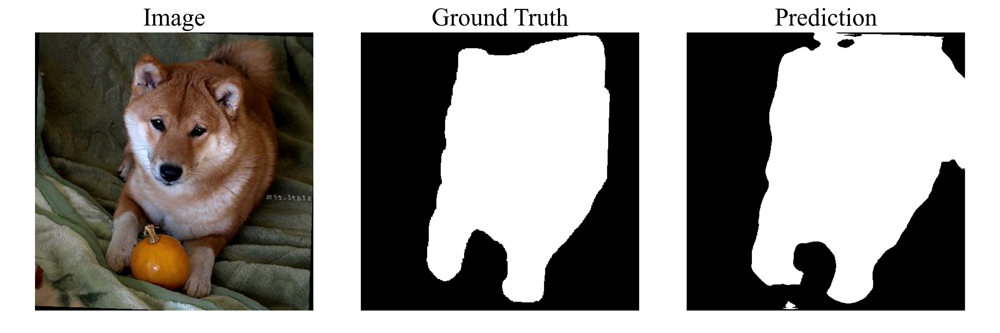


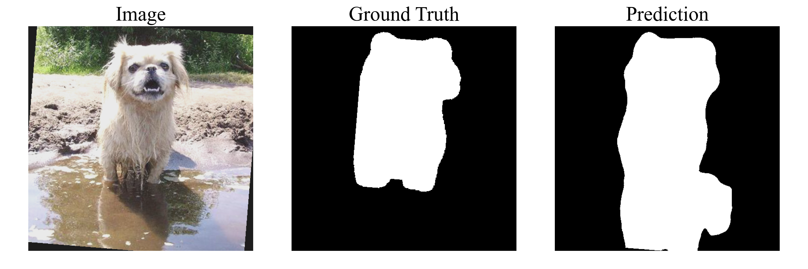

### 2.3.4 结果分析

经过引入 Dice Loss 和 Edge Loss 后，UNet 模型分割性能并没有得到明显提升，说明在当前数据集和网络结构下，单纯优化损失函数对性能改善有限，模型瓶颈可能更多地来自特征提取能力不足。因此，进一步引入 ResNet34 作为编码器，构建 ResNet34-UNet 模型，并在网络中加入批量归一化（Batch Normalization）层，以提升训练稳定性和模型泛化能力。

在训练效率方面，ResNet34-UNet 表现出明显优势。单个 epoch 的训练时间由原始 UNet 的约 8 min 降低至约 3 min，训练效率提升约 62.5%。这主要得益于 ResNet 编码器在前期通过 stride=2 卷积和最大池化快速降低特征图分辨率，使得后续大部分计算在较低分辨率特征图上完成，从而减少了计算量。

在分割性能方面，虽然 ResNet34-UNet 仅训练了 20 个 epoch（少于原始 UNet 的 50 个 epoch），但其验证集 Dice 指标已达到 0.9274，显著高于原始 UNet 的约 0.8950，提升约 3.24%。从可视化结果来看，改进后的模型在复杂背景、光照变化以及纹理干扰较强的样本上表现更加稳定，能够更准确地区分前景目标与背景区域，误检现象明显减少，分割轮廓也更加平滑。

实验结果表明，相较于损失函数层面的改进，网络架构优化带来的收益更为显著。ResNet34 编码器通过更深层的残差结构增强了多尺度特征提取能力，使模型能够学习到更丰富的语义信息，从而有效提升分割精度。这说明当前 UNet 模型的主要性能瓶颈并不在损失函数设计，而在于编码器的特征表达能力不足。

# 3. 总结

本次实验围绕 U-Net 语义分割模型进行了多阶段改进与优化。首先，将输入图像分辨率由 256×256 提升至 512×512，以保留更多细节信息；同时尝试数据增强以提升模型泛化能力，但整体提升有限。随后，在损失函数层面引入 Dice Loss 和 Edge Loss，构建复合损失函数，以增强模型对目标区域重叠度和边缘信息的关注，但实验结果表明，仅通过损失函数改进并未带来显著性能提升。

在此基础上，进一步从网络结构层面进行优化，将原始 U-Net 编码器替换为 ResNet34 残差编码器，构建 ResNet34-UNet 模型。实验结果显示，相较于前述改进，网络结构优化带来的收益最为明显：模型不仅显著提升了分割精度，同时训练效率也大幅提高。总体而言，本次实验表明，相比输入分辨率、数据增强和损失函数调整，编码器特征提取能力的提升对分割性能影响更为关键，网络结构优化是提升模型性能的主要方向。
